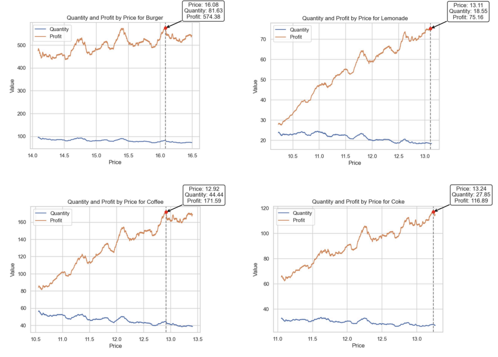

# FoodKiosk
Price Optimization and Profitability Engine

#### -- Project Status: Completed

## Project Intro & Objective
In the context of food kiosks (eg. Cafés), there is a vital need to understand the price elasticity of demand for their offerings, as ingredient costs are prone to significant variability. The central challenge is determining the extent to which the prices of food items can be adjusted without substantially affecting customer demand. This knowledge is critical for developing pricing strategies that maximize profitability while retaining customer loyalty in a competitive food retail sector.

### Methods Used
* Exploratory Data Analysis in R
* Linear Regression

### Technologies
* R
* RStudio

## Optimal Price Determination

